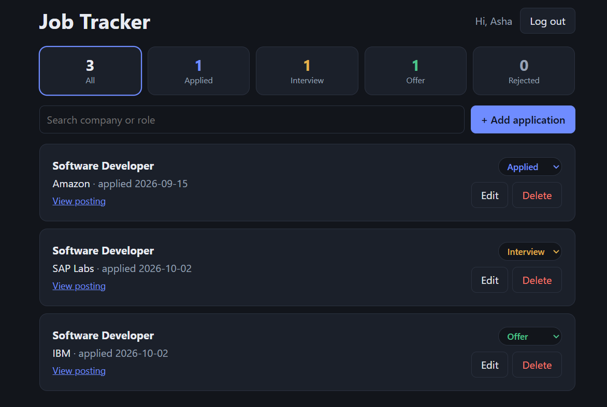

# Job Tracker

A full stack web app to track job applications. Create an account, add applications, move them through stages (Applied, Interview, Offer, Rejected), search, filter, and see a live dashboard.



**Live demo:** _coming soon_

## Tech stack
- **Frontend:** React (Vite), plain CSS, responsive layout
- **Backend:** Node.js, Express REST API
- **Database:** MySQL
- **Auth:** JWT tokens, passwords hashed with bcrypt

## Features
- Register and log in (JWT, 7-day sessions)
- Add, edit and delete applications (company, role, status, link, notes, date)
- Change an application's status straight from the list
- Dashboard counts per status (SQL `GROUP BY`); click a count to filter
- Search by company or role
- Every user sees only their own data (all queries are scoped by `user_id`)

## API
| Method | Endpoint | Description |
|---|---|---|
| POST | `/api/auth/register` | Create account, returns token |
| POST | `/api/auth/login` | Log in, returns token |
| GET | `/api/jobs?status=&search=` | List your jobs (login required) |
| GET | `/api/jobs/stats` | Count per status |
| POST | `/api/jobs` | Add a job |
| PUT | `/api/jobs/:id` | Update a job |
| DELETE | `/api/jobs/:id` | Delete a job |

## Run it locally
Requirements: Node.js 18+ and MySQL.

1. **Database:** run `server/schema.sql` in MySQL (Workbench or `mysql -u root -p < server/schema.sql`).
2. **Backend:**
```bash
   cd server
   cp .env.example .env     # then edit DB_PASSWORD and JWT_SECRET
   npm install
   npm start                # http://localhost:5000
```
3. **Frontend** (new terminal):
```bash
   cd client
   cp .env.example .env
   npm install
   npm run dev              # http://localhost:5173
```

## What I learned
- Designing a relational schema with foreign keys and indexes
- Securing routes with JWT middleware and scoping data per user
- Connecting a React frontend to an Express API and handling CORS

## Next steps
- Deploy with a live demo
- Password reset, follow-up reminders, and automated tests
